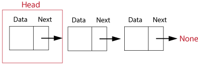

# Linked Lists

A linked list is a collection of objects. Each element is called an node and stores the data of the element along with a reference to the next node in the list. Nodes do not have to be stored sequentially in memomry.


The first node is called the head and is the starting point when interating through a list. The last node in the list will have it's reference pointing to none.



A doubly linked list will have two references. One to the previous node and one to the next node. This allows the list to be traversed both forwards and backwards.


Some of the applications for linked lists include

- Lifecycle management of an operating system
- Implementation of stacks and queues
- Redo and undo functionality

**The code examples below are for working with singly linked lists**

## Creating a Linked List

To create a linked list, first create a class to represent the linked list. This will contain a single node for the head of the list.

```python
class LinkedList:
   def __init__(self):
      self.head = None;
```

Then create a class for the nodes. This will create a node to hold the data and set the pointer to the next node in the list.

```python
#class for a singly linked list
class Node:
   def __init__(self, data, next=None):
      self.data = data
      self.next = next
```

## Basic Operations

After you have the intial set up of the Linked list and a single node you can perform some basic operations to traverse, insert and remove nodes.

### Inserting a Node

To insert a node a the beginning of a list

- Make the next of the new node the current head
- Move the head to point to the new node

```python
def insert_head(self, data):
   newNode = Node(data)
   newNode.next = self.head
   self.head = newNode
```

To insert a node at the end of the list

```python
def insert_end(self, data):
   newNode = Node(data)

   current = self.head

   while(current.next != null) {
      current = current.next
   }
   current.next = newNode
```

To insert a node after a given node

- Check to see if node exists
- Change the previous node to point to the new node
- Point the new node to the next node

```python
def insert_after(self, prev_node, new_data):

    current = self.head
    newNode = Node(new_data)

    if prev_node is None:
        return
    # set the new node next to the given node next
    newNode.next = current.next
    # set the given node next to the new node
    current.next = newNode

    current = current.next
```

### Traversing a Linked List

```python
def traverse(self):
   #set node to equal the head to start at the beginning of list
   node = self.head
   while node is not None:
      #print of do something with the nodes
      print(node.data)
      #set the node to the next node in the list
      node = node.next
```

### Removing a Node

To remove a node in a singly linke list

```python
def remove(self, value):
   #start at the head of the list
   tempNode = self.head

  #if the node to be deleted is the head, set the head to the next node
   if tempNode.data == value:
      self.head = self.head.next
      return

   #keep track of the previous node
   previous_node = self.head

#loop through the list
   for node in self:
      #if the node to be deleted is found next the previous node next to the deleted node next
      if node.data == value:
         previous_node.next = node.next
         return
      #otherwise set the previous node to the node to keep going through the list
      previous_node = node
```

## Example

For this problem we are going to demostrate the basic functions by working with a list of students. You are working as an admissions staff at a high school and were given a list of students for the class list to be created.

Class list:
Conner, Ethan, Joe, John, Joshua, Mary, Sally, Steve

After creating the class list you were given an updated list.

Class list:
Ethan, Joe, John, Kylie, Mary, Sally, Steve

If we put all the code above together we can create a list, then add and remove students as needed.

```python
class Node:
    def __init__(self, data=None):
        self.data = data
        self.next = None


class LinkedList:
    def __init__(self, head=None):
        self.head = head

    def insert_head(self, data):
        newNode = Node(data)
        if self.head is None:
            self.head = newNode

    def insert_end(self, data):
       newNode = Node(data)
        # create a tempory pointer to work through the list starting at the head
        current = self.head
        # loop through the list until the next is not pointed at a node
        while (current.next is not None):
            current = current.next
        # set the next of the current node to the new node
        current.next = newNode

    def insert_after_(self, prev_node, new_data):

        current = self.head
        newNode = Node(new_data)

        if prev_node is None:
            return
        # set the new node next to the given node next
        newNode.next = current.next
        # set the given node next to the new node
        current.next = newNode

        current = current.next

    def __iter__(self):
        # set node to equal the head to start at the beginning of list
        node = self.head
        while node is not None:
            yield node
            # set the node to the next node in the list
            node = node.next

    def remove(self, value):
        # start at the head of the list
        current = self.head

       # if the node to be deleted is the head, set the head to the next node
        if current.data == value:
            self.head = self.head.next
            return

        # keep track of the previous node
        previous_node = self.head

    # loop through the list
        for node in self:
            # if the node to be deleted is found next the previous node next to the deleted node next
            if node.data == value:
                previous_node.next = node.next
                return
            # otherwise set the previous node to the node to keep going through the list
            previous_node = node

#This function prints the list in a readable format
    def __str__(self):
        result = ""
        node = self.head
        while node:
            result += str(node.data) + ", "
            node = node.next

        result = result.strip(", ")
        if len(result):
            return "[" + result + "]"
        else:
            return "[]"

#first create the linked list and add the first student to the head, then add other students to the end.
list = LinkedList()
list.insert_head("Conner")
list.insert_end("Ethan")
list.insert_end("Joe")
list.insert_end('John')
list.insert_end("Joshua")
list.insert_end("Mary")
list.insert_end("Sally")
list.insert_end("Steve")
print(list) #[Conner, Ethan, Joe, John, Joshua, Mary, Sally, Steve]

#remove students that are taken off the list and add the student in the correct position by using the insert_after function
list.remove("Conner")
list.remove("Joshua")
list.insert_after("John", "Kylie")
print(list) #[Ethan, Kylie, Joe, John, Mary, Sally, Steve]

```

## Problem to Solve

For this problem start with the code above to create a linked list containing the following values:

- Chevy
- Ford
- GMC
- BMW
- KIA
- Honda
- Subaru

Then create a function that will get the count of items in the linked list.

[Solution](linkedlist.py)
