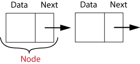

# Linked Lists

A linked list is a collection of objects. Each element is called an node and stores the data of the element along with a reference to the next node in the list. Nodes do not have to be stored sequentially in memomry.

The first node is called the head and is the starting point when interating through a list. The last node in the list will have it's reference pointing to none.

A doubly linked list will have two references. One to the previous node and one to the next node. This allows the list to be traversed both forwards and backwards.

Some of the applications for linked lists include

- Lifecycle management of an operating system
- Implementation of stacks and queues
- Redo and undo functionality

## Creating a Linked List

## Basic Operations

### Traversing a Linked List

### Inserting a Node

### Removing a Node

## Example

## Problem to Solve
