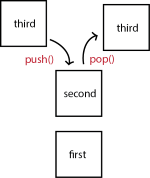

# Stack

A stack is used for data storage, storing the items in the order they were added. It only allows data to be removed from the top of the stack though. This is the Last-in-First-Out (LIFO) principle.

Some common applications for stack are

- The back button on a website
- CTRL+Z on a Windows computer
- Storing parameters and variables

These all follow the LIFO pricinple where the last thing stored is the first thing removed.

## Creating a Stack

A list can be used to represent a stack. This makes preforming operations on stack easy by using the list functions.

```python
#create the stack by using a list
stack = []

#add elements to the list
stack.append("first");
stack.append("second");
stack.append("third");

#remove the last element added
stack.pop();
```

This will create a stack like this.



## Basic Operations

Some of the basic operations for stack are:

- push() - adds a value to the top of the stack
- pop() - removes and returns the top item in the stack
- size() - returns the size of the stack
- empty() - returns true if the stack is empty

| Stack Operation | Python Code         |
| --------------- | ------------------- |
| push()          | stack.append(value) |
| pop()           | value = stack.pop() |
| size()          | len(stack)          |
| empty()         | if len(stack) == 0  |

These operation will all result in a O(1) preformance using Big O Notation.

## Example

For this example we will use the scenario of rotating inventory.As The item numbers were added to the stack in this order: 1, 2, 3, 4...which means the last one added will be the first one out. In order for the oldest to be used first the stack needs to be reversed. Write a simple program that will reverse the list so the oldest item is taken out first.

```python
#the order the inventory was entered
inventoryList = "1 2 3 4 5 6 7 8 9 10"

#first create an empty stack to store the new order
newList = []

#interate through the inventory list and add it to the new list
while len(inventoryList) > 0:
   newList.append(inventoryList.pop())

#now the inventory is listed in the stack with the oldest at the end
print(newList) #[10, 9, 8, 7, 6, 5, 4, 3, 2, 1]
```

## Problem to Solve

You are creating an assignment reminder app that will notify the user when assignments are due. To implement this you need to add the assingments to a stack with the assignment that is due last at the bottom of the stack and the earliest assingment at the top. Then loop through the stack, popping the earliest due date and reprint the stack with each pop. The last print line will be an empty stack.

Assignment due dates:

- April 3
- April 15
- May 5
- June 26
- July 15
- June 10
- May 25

[Solution](assignment.py)

[Back to Welcome](Intro.md)
