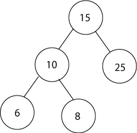
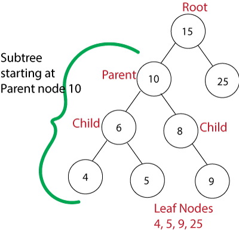

# Trees

Trees are similar to linked lists where the nodes are connected with pointers. Binary trees is a little different in that each node only has two children nodes. The top node is the root node, with the left node being smaller and the right node being larger.



Binary trees can be searched efficently, usually in O(log n) time where n is the number of nodes. Insertion and deletion operations are also done effieciently. They also have reduced storage requirements since each node only has two pointers.

Some cases where binary trees are used are

- File systems
- Search engines
- Game AI

## Parts of a Tree



**Root** - The top most node of a tree

**Child Node** - any node with a parent node

**Leaf Nodes** - nodes that don't have any children

**Subtrees** - made by selecting a node to be the root and all children of that node

## Basic Operations

Some of the basic operations that will be covered are creating the nodes, inserting an element, and searching for a specific element.

### Creating a Tree

Creating a tree starts with creating a Node class to and setting the left and right nodes to none, and a value that acts as a key.

```python
class TreeNode:
    def __init__(self, value=None):
        self.left = None
        self.right = None
        self.data = value
```

### Inserting an Element

Next we will insert an element by checking if self.data has a value already. If not this becomes the root of our tree. If it already has a value we check to see which side of the tree the new value should be inserted into. This is done recursively until a empty spot is found in the tree.

```python
def insert(self, data):
        # if the node has no value set it to the given value
        if self.data is None:
            self.data = data
            return

        # If the value is already in the tree return
        if self.data == data:
            return

        # if the value is less than the node search the left side recursively
        # until there is an empty spot to insert the new node
        if data < self.data:
            if self.left:
                self.left.insert(data)
                return
            self.left = TreeNode(data)
            return

        # do the same for the right side if the value is greater than the node
        if data > self.data:
            if self.right:
                self.right.insert(data)
                return
            self.right = TreeNode(data)
```

### Searching for an element

Again searching for a specific value in a binary tree makes use of recursive functions.

```python
def search(self, value):
        # if the value equals the current node return true
        if value == self.data:
            return True

        # if the value is less than the current node search the left side of the tree
        if value < self.data:
            # when it gets to the end of the left side the value is not in the tree
            if self.left is None:
                return False
           # recursive function to search all of the nodes to the left
            return self.left.search(value)

        # do the same for the right if the value is greater than the current node
        if value > self.data:
            if self.right is None:
                return False
            return self.right.search(value)
```

## Example

In this example we will create a binary tree and and a function to print the values from the tree.

```python
class TreeNode:
    def __init__(self, value=None):
        self.left = None
        self.right = None
        self.data = value

    def insert(self, data):
        # if the node has no value set it to the given value
        if self.data is None:
            self.data = data
            return

        # If the value is already in the tree return
        if self.data == data:
            return

        # if the value is less than the node search the left side recursively
        # until there is an empty spot to insert the new node
        if data < self.data:
            if self.left:
                self.left.insert(data)
                return
            self.left = TreeNode(data)
            return

        # do the same for the right side if the value is greater than the node
        if data > self.data:
            if self.right:
                self.right.insert(data)
                return
            self.right = TreeNode(data)

    def search(self, value):
        # if the value equals the current node return true
        if value == self.data:
            return True

        # if the value is less than the current node search the left side of the tree
        if value < self.data:
            # when it gets to the end of the left side the value is not in the tree
            if self.left is None:
                return False
           # recursive function to search all of the nodes to the left
            return self.left.search(value)

        # do the same for the right if the value is greater than the current node
        if value > self.data:
            if self.right is None:
                return False
            return self.right.search(value)

    def printTree(self):
        if self.left:
            self.left.printTree()
        print(self.data)
        if self.right:
            self.right.printTree()


tree = TreeNode()
tree.insert(15)
tree.insert(25)
tree.insert(32)
tree.insert(10)
tree.insert(65)
tree.insert(45)

tree.printTree() #10 15 25 32 45 65
```

## Problem to Solve

Create a binary tree and insert the following values:
10, 25, 86, 98, 45, 65, 85, 21, 32, 62

After inserting then print the tree and write a function that will return the smallest value of the tree and a function to return the largest value from the tree.

[Solution](binarytree.py)
